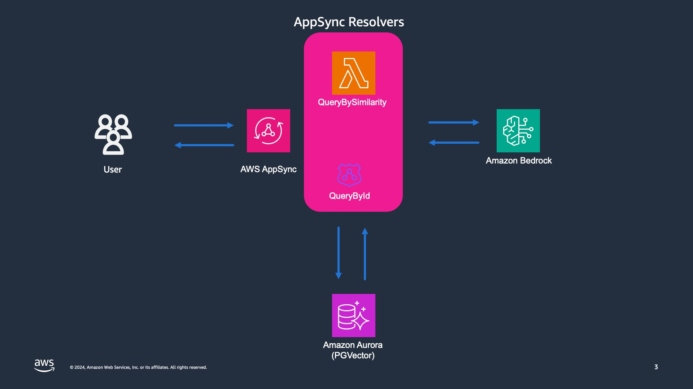
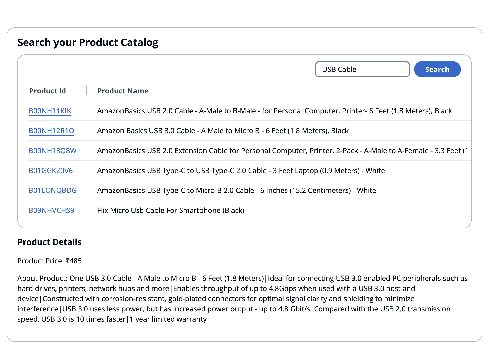

# Build a similarity search engine with AWS AppSync, Amazon Aurora and Amazon Bedrock

This project implements search similarity with AWS AppSync as the frontend with PostGres RDS Datasource. We use the PostGreSQL PGVector extension for storing embeddings of records.

## Dataset

The example dataset to use is an Amazon Product dataset. It has the following schema
```
type product {
  product_id: String!
  product_name: String!,
  category: String,
  discounted_price: String,
  actual_price: String,
  discount_percentage: String,
  rating: String,
  rating_count: String,
  about_product: String
}
```

To run this sample, replace the file assets/amazon.csv with data from https://www.kaggle.com/datasets/karkavelrajaj/amazon-sales-dataset. You can also use other datasets, just change the above schema according to the data set schema.

## Pre-requisities

You need to first enable Amazon Bedrock Titan Embeddings model in the region where this stack will be deployed. This is required to generate the vector embeddings. If you dont know how to do this see an explanation in the  [Amazon Bedrock documentation](https://docs.aws.amazon.com/bedrock/latest/userguide/model-access.html)

## Implementation

This sample implements a CDK stack which consists of a database stack implemented using RDS PostGresSQL, a stack for importing data using ECS Tasks, and an API layer using AWS AppSync. 

## Architecture



## How to use

Install the packages - from the root directory execute
```
npm install
```

Boostrap the cdk by running `cdk bootstrap` also in the project root, **NOTE:** make sure you are running Node<21.0.0

### Deploy the database
To deploy the database stack use the following command
```
cdk deploy RDSStack
```
This command will output the cluster information, secret arn and all the other properties you will need.

Accept the security prompt '
Do you wish to deploy these changes (y/n)? y'

After you deploy the cluster, you need to enable the PGVector extension. Using the cluster and secret details from the above command, login to the RDS Query Editor and execute the following command.  If you dont know how to do this refer to the [Query Editor Docs](https://docs.aws.amazon.com/AmazonRDS/latest/AuroraUserGuide/query-editor.html#query-editor.running)

```
CREATE EXTENSION IF NOT EXISTS vector;
```

### Import Data
Next deploy the import data stack using the following command, again from the root of the project
```
cdk deploy ImportDataStack
```
This task requires docker desktop to be running as it builds a docker image to run the import task of ECS. One of the outputs of the stack is an arn for a step function state machine, which you feed into the next command. 

After this stack is deployed, execute the stepfunction
```
aws stepfunctions start-execution --state-machine-arn <STATE-MACHINE-ARN>
```
The step function executes two ecs tasks. The first one reads the product data from s3 and creates a new file with necessary embeddings. A second task imports the data with embeddings into the RDS PostGresSQL database.

Wait for the step function to complete. You can check the state in the aws console or from the command line by executing the following
```
aws stepfunctions describe-execution --execution-arn <EXECUTION-ARN>
```

Check if the data is populated within RDS using the [RDS query editor](https://docs.aws.amazon.com/AmazonRDS/latest/AuroraUserGuide/query-editor.html#query-editor.running) to list records in the "product_info" table.

## Deploy the middleware from an Amplify Gen2 project

Navigate to the folder lib/amp-client. You can deploy the AppSync middleware that connects to the database using this stack. We will create a sandbox environment to test this by running the following

```
npm install
npx ampx sandbox --debug true
```
The above command will deploy the necessary backend for connecting to the database. If your not familiar with Amplify Gen2, its worth reading about [Here](https://docs.amplify.aws/react/build-a-backend/data/set-up-data/)

## Run the client and connect to the backend

Run the amplify webserver client by executing
```
npm run dev
```

and navigate to the output url in a browser where can then use the functionality of the search application.


