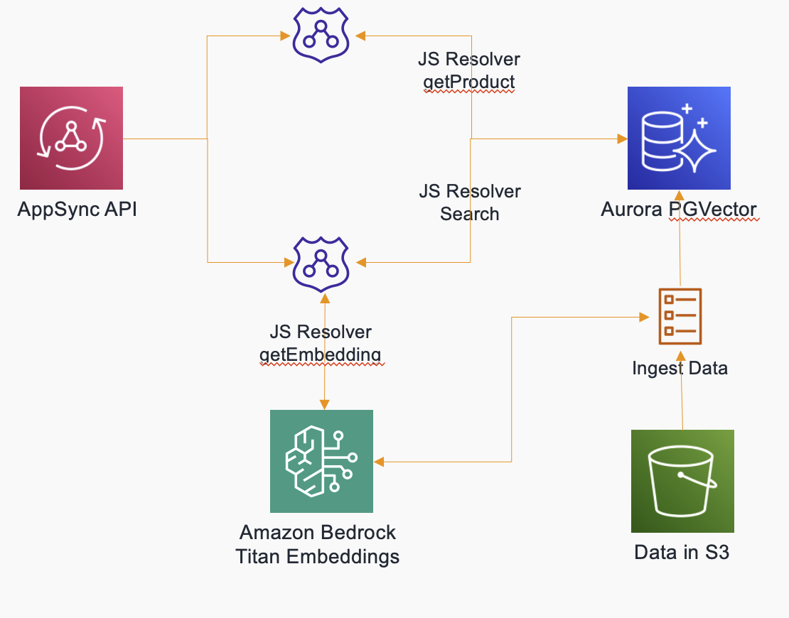

# Build a similarity search engine with AWS AppSync, Amazon Aurora and Amazon Bedrock

This project implements search similarity with AWS AppSync as the frontend with PostGres RDS Datasource. We use the PostGreSQL PGVector extension for storing embeddings of records.

## Dataset

The example dataset to use is an Amazon Product dataset. It has the following schema
```
type product {
  product_id: String!
  product_name: String!,
  category: String,
  discounted_price: String,
  actual_price: String,
  discount_percentage: String,
  rating: String,
  rating_count: String,
  about_product: String
}
```

To run this sample, replace the file assets/amazon.csv with data from https://www.kaggle.com/datasets/karkavelrajaj/amazon-sales-dataset. You can also use other datasets, just change the above schema according to the data set schema.

## Pre-requisities

You need to first enable Amazon Bedrock Titan Embeddings model in the region where this stack will be deployed. This is required to generate the vector embeddings.

## Implementation

This sample implements a CDK stack which consists of a database stack implemented using RDS PostGresSQL, a stack for importing data using ECS Tasks, and an API layer using AWS AppSync. 

## Architecture



## How to use

Intall the packages - 'npm install'

Boostrap the cdk using `cdk bootstrap`, make sure you are running Node<21.0.0

Deploy the database stack using
```
cdk deploy RDSStack
```
This command will output the cluster information, secret arn, etc

Accept the security prompt '
Do you wish to deploy these changes (y/n)? y'

After you deploy the cluster, you need to enable the PGVector extension. Using the cluster and secret details from the above command, login to the RDS Query Editor and execute the following command

```
CREATE EXTENSION IF NOT EXISTS vector;
```

Deploy the import data stack using
```
cdk deploy ImportDataStack
```
This task requires docker desktop to be running as it builds a docker image to run the import task of ECS.

After this stack is deployed, navigate to the ECS console and execute the tasks for generating embeddings. This will read the product data from s3 and create a new file with necessary embeddings. Once completed, execture the import data ECS task - this imports the data with embeddings into the RDS PostGresSQL database.

Check if the data is populated within RDS using the query editor to list records in the "product_info" table.

Deploy the AppSycn middleware stack using
```
cdk deploy AppsyncStack
```

After completing, you can use the online appsycn editor to query the database for similarity.


